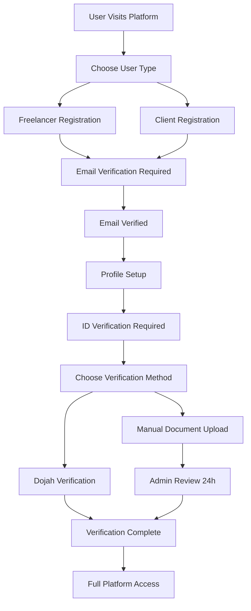
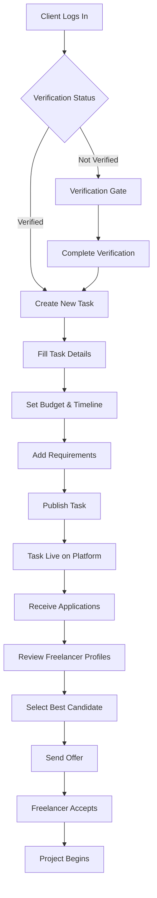
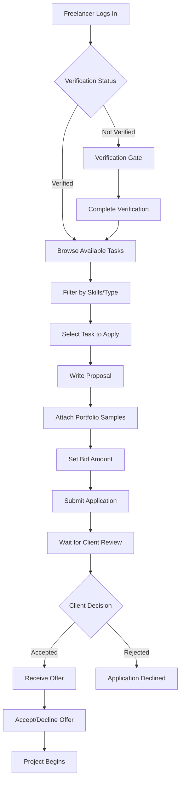

# TaskLinker Platform - Complete System Overview

**Version:** 2.0 (Post-Manual Verification Integration)  
**Last Updated:** January 27, 2025  
**Purpose:** Comprehensive documentation of platform architecture, user flows, and management systems  

---

## Table of Contents

1. [Platform Overview](#platform-overview)
2. [User Types & Roles](#user-types--roles)
3. [Core User Flows](#core-user-flows)
4. [Authentication & Verification System](#authentication--verification-system)
5. [Task Management System](#task-management-system)
6. [Application & Hiring Process](#application--hiring-process)
7. [Payment & Escrow System](#payment--escrow-system)
8. [Admin Management System](#admin-management-system)
9. [Security & Compliance](#security--compliance)
10. [Technical Architecture](#technical-architecture)

---

## Platform Overview

TaskLinker is a comprehensive freelance marketplace platform that connects skilled freelancers with clients seeking professional services. The platform provides a complete ecosystem for task posting, bidding, project management, and secure payments.

### Core Value Proposition
- **For Clients**: Find verified, skilled freelancers for projects with secure escrow protection
- **For Freelancers**: Access quality projects with guaranteed payment and dispute resolution
- **For Platform**: Facilitate safe, efficient transactions with quality assurance

---

## User Types & Roles

### 1. Freelancers
**Primary Goal**: Find and complete paid projects

**Capabilities:**
- Browse available tasks
- Apply to projects with proposals
- Submit work samples and portfolios
- Track earnings and payment history
- Build reputation through reviews
- Manage profile and skills

**Verification Requirements:**
- Email verification (Step 1)
- Identity verification via Dojah or Manual Upload (Step 2)
- Profile completion (optional but recommended)

### 2. Clients
**Primary Goal**: Post projects and hire skilled freelancers

**Capabilities:**
- Create detailed project listings
- Review freelancer applications
- Select and hire freelancers
- Manage project milestones
- Provide feedback and ratings
- Handle secure payments

**Verification Requirements:**
- Email verification (Step 1)
- Business verification via Dojah or Manual Upload (Step 2)
- Company profile completion (optional)

### 3. Admins
**Primary Goal**: Manage platform operations and user support

**Capabilities:**
- Monitor all platform activity
- Process manual verifications
- Manage user accounts and disputes
- Oversee payment transactions
- Generate analytics and reports
- Provide customer support

**Access Level:**
- Full platform access
- Bypass verification requirements
- Emergency user unblocking capabilities

---

## Core User Flows

### New User Registration Flow

### Task Posting Flow (Clients)

### Task Application Flow (Freelancers)

---

## Authentication & Verification System

### Multi-Layer Security Architecture

#### Layer 1: Email Verification
**Purpose**: Confirm user identity and prevent spam accounts

**Process:**
1. User registers with email address
2. System sends 6-digit verification code
3. User enters code to verify email
4. Account marked as email verified
5. User gains basic platform access

**Technical Implementation:**
- Supabase Auth integration
- OTP system with 10-minute expiration
- Automatic retry mechanism
- Rate limiting for security

#### Layer 2: Identity Verification
**Purpose**: Verify user identity for task posting/application access

**Two Verification Methods:**

**A. Dojah Verification (Primary)**
- Real-time document verification
- Automated identity confirmation
- 2-5 minute processing time
- Supports multiple document types
- Integrated biometric verification

**B. Manual Verification (Backup)**
- Document upload system
- Admin review process
- 24-hour response time
- Supports same document types
- Quality scoring system (1-100)

**Document Types Supported:**
- National ID Cards
- Voter Identification Cards
- Driver's Licenses
- International Passports
- Other Government IDs

**Verification Status Levels:**
- ❌ **Not Verified**: Email only, limited access
- ⚠️ **Email Verified**: Can browse but not apply/post
- ✅ **Fully Verified**: Complete platform access
- 🚨 **Emergency Bypass**: Admin-override for urgent cases

### Verification Gate System

**Purpose**: Control access to platform features based on verification status

**Implementation:**
- Automatic redirects to verification steps
- Clear progress indicators
- Multiple verification options
- Graceful fallback mechanisms

**Access Control Matrix:**

| Feature | Email Only | Email + ID | Admin Override |
|---------|------------|------------|----------------|
| Browse Platform | ✅ | ✅ | ✅ |
| View Task Details | ✅ | ✅ | ✅ |
| Apply to Tasks | ❌ | ✅ | ✅ |
| Post Tasks | ❌ | ✅ | ✅ |
| Messaging | ❌ | ✅ | ✅ |
| Payments | ❌ | ✅ | ✅ |

---

## Task Management System

### Task Creation Process

#### Step 1: Task Information
- **Title**: Clear, descriptive project name
- **Category**: Predefined categories (Web Dev, Design, Writing, etc.)
- **Description**: Detailed project requirements
- **Skills Required**: Tag-based skill matching
- **Timeline**: Project duration and milestones

#### Step 2: Budget & Payment
- **Budget Type**: Fixed price or hourly rate
- **Budget Range**: Min/max budget selection
- **Payment Schedule**: Milestone-based or completion-based
- **Escrow Protection**: Automatic fund protection

#### Step 3: Requirements & Preferences
- **Experience Level**: Junior, Mid-level, Senior
- **Location Preference**: Local, Remote, Any
- **Portfolio Requirements**: Work samples needed
- **Custom Questions**: Client-specific inquiries

### Task Discovery & Matching

#### Smart Matching Algorithm
- **Skill Matching**: AI-powered freelancer-task matching
- **Experience Filtering**: Match experience levels
- **Availability Check**: Real-time freelancer availability
- **Quality Scoring**: Reputation and portfolio assessment

#### Search & Filter System
- **Text Search**: Title and description search
- **Category Filtering**: Filter by project type
- **Budget Range**: Filter by budget constraints
- **Timeline**: Filter by project duration
- **Location**: Geographic filtering
- **Skills**: Tag-based skill filtering

### Task Status Management

**Task Lifecycle:**
1. **Draft**: Client preparing task details
2. **Active**: Task published and accepting applications
3. **In Progress**: Freelancer selected and work started
4. **Under Review**: Work submitted for client review
5. **Completed**: Project finished and payment released
6. **Cancelled**: Task cancelled by client or freelancer

**Status Transitions:**
- Automatic status updates based on actions
- Manual status changes by authorized users
- Time-based automatic transitions
- Dispute resolution workflows

---

## Application & Hiring Process

### Application Submission

#### Freelancer Application Components
1. **Cover Letter**: Personalized proposal explaining approach
2. **Proposal Details**: Project timeline and methodology
3. **Bid Amount**: Competitive pricing for the project
4. **Portfolio Samples**: Relevant work examples
5. **Answers to Custom Questions**: Client-specific responses

#### Application Review Process
1. **Initial Screening**: Automated quality checks
2. **Client Review**: Manual evaluation of applications
3. **Portfolio Assessment**: Review of work samples
4. **Communication**: Q&A between client and freelancer
5. **Decision Making**: Client selects preferred candidate

### Hiring & Onboarding

#### Offer Process
1. **Client Makes Offer**: Formal offer with terms
2. **Freelancer Review**: Evaluate offer details
3. **Negotiation**: Optional price/timeline adjustments
4. **Acceptance**: Freelancer accepts offer
5. **Contract Creation**: Formal agreement established

#### Project Kickoff
1. **Initial Meeting**: Project briefing and expectations
2. **Milestone Planning**: Break down project into phases
3. **Communication Setup**: Establish communication channels
4. **Resource Access**: Provide necessary tools and access
5. **Work Commencement**: Begin project execution

---

## Payment & Escrow System

### Escrow Protection

**Purpose**: Secure both parties by holding funds until work completion

**How It Works:**
1. **Fund Deposit**: Client deposits payment into escrow
2. **Work Execution**: Freelancer completes work
3. **Delivery**: Freelancer submits completed work
4. **Review Period**: Client has time to review work
5. **Payment Release**: Funds released to freelancer

**Dispute Resolution:**
- **Mediation Process**: Platform mediates disputes
- **Evidence Review**: Both parties provide evidence
- **Resolution Timeline**: 7-day resolution process
- **Refund Process**: Automatic refunds for valid disputes

### Payment Methods

**Supported Payment Methods:**
- **Paystack Integration**: Nigerian payment processing
- **Bank Transfer**: Direct bank account transfers
- **Card Payments**: Credit/debit card processing
- **Mobile Money**: Mobile wallet integration

**Payment Security:**
- **PCI Compliance**: Secure payment processing
- **Encryption**: All payment data encrypted
- **Fraud Detection**: Automated fraud prevention
- **Audit Trail**: Complete payment history

### Withdrawal System

**Freelancer Withdrawals:**
1. **Request Withdrawal**: Freelancer initiates withdrawal
2. **Balance Verification**: Confirm available balance
3. **Processing Time**: 1-3 business days
4. **Bank Transfer**: Funds transferred to bank account
5. **Confirmation**: Withdrawal confirmation sent

**Withdrawal Limits:**
- **Minimum Amount**: ₦1,000 minimum withdrawal
- **Daily Limits**: ₦100,000 daily withdrawal limit
- **Processing Fees**: 1% processing fee per withdrawal
- **Tax Compliance**: Automatic tax calculation and reporting

---

## Admin Management System

### Admin Dashboard Overview

**Main Dashboard Features:**
- **User Statistics**: Total users, active users, verification status
- **Platform Metrics**: Task posting, applications, completions
- **Revenue Tracking**: Payment volume, commission earnings
- **System Health**: Performance metrics and error rates

### User Management

#### User Account Management
- **User Search**: Find users by name, email, or ID
- **Account Status**: View verification and activity status
- **Profile Management**: Edit user profiles and settings
- **Account Actions**: Suspend, activate, or delete accounts

#### Verification Management
- **Manual Verification Queue**: Review document submissions
- **Emergency Bypass**: Instantly verify users for urgent cases
- **Verification Statistics**: Track approval rates and response times
- **Quality Monitoring**: Monitor verification accuracy

#### Support Management
- **Support Tickets**: Handle user inquiries and issues
- **Dispute Resolution**: Mediate conflicts between users
- **Refund Processing**: Handle payment disputes and refunds
- **Communication**: Send notifications and updates to users

### Platform Analytics

#### User Analytics
- **Registration Trends**: New user signup patterns
- **Verification Rates**: Email and ID verification success rates
- **Activity Metrics**: User engagement and platform usage
- **Geographic Distribution**: User location analysis

#### Business Analytics
- **Task Volume**: Number of tasks posted and completed
- **Application Rates**: Freelancer application patterns
- **Completion Rates**: Project success and completion metrics
- **Revenue Analysis**: Payment volume and commission tracking

#### Performance Metrics
- **Response Times**: System performance and user experience
- **Error Rates**: Technical issues and system stability
- **Security Metrics**: Fraud detection and prevention statistics
- **Compliance Tracking**: Regulatory compliance monitoring

---

## Security & Compliance

### Data Protection

#### User Data Security
- **Encryption**: All sensitive data encrypted at rest and in transit
- **Access Controls**: Role-based access to user information
- **Data Retention**: Automatic deletion of old verification documents
- **Privacy Compliance**: GDPR and local privacy law compliance

#### Financial Security
- **PCI Compliance**: Secure payment processing standards
- **Fraud Detection**: Automated fraud prevention systems
- **Audit Trails**: Complete transaction and action logging
- **Secure Storage**: Encrypted storage of financial data

### Regulatory Compliance

#### Identity Verification
- **KYC Compliance**: Know Your Customer requirements
- **AML Compliance**: Anti-Money Laundering regulations
- **Document Verification**: Government-issued ID validation
- **Audit Requirements**: Complete verification audit trails

#### Business Operations
- **Tax Compliance**: Automatic tax calculation and reporting
- **Contract Law**: Legally binding user agreements
- **Dispute Resolution**: Formal mediation and arbitration processes
- **Data Protection**: Privacy law compliance and user rights

---

## Technical Architecture

### System Components

#### Frontend Architecture
- **Next.js 15**: Modern React framework with server-side rendering
- **TypeScript**: Type-safe development and reduced errors
- **Tailwind CSS**: Utility-first styling framework
- **Component Library**: Reusable UI components
- **State Management**: Context API for application state

#### Backend Architecture
- **Supabase**: Database, authentication, and real-time features
- **PostgreSQL**: Relational database with advanced features
- **Row Level Security**: Database-level access control
- **API Routes**: RESTful API endpoints
- **Real-time Updates**: Live data synchronization

#### Third-Party Integrations
- **Dojah**: Identity verification service
- **Paystack**: Payment processing
- **Supabase Storage**: File storage and management
- **Email Services**: Transactional email delivery

### Database Schema

#### Core Tables
- **Users**: User profiles and authentication data
- **Tasks**: Project listings and details
- **Applications**: Freelancer applications to tasks
- **Messages**: Communication between users
- **Payments**: Transaction records and escrow data

#### Verification Tables
- **Manual Verification Submissions**: Document upload records
- **Verification Audit Log**: Complete audit trail
- **Admin Verification Queue**: Admin dashboard data

#### System Tables
- **Notifications**: User notification system
- **Support Tickets**: Customer support management
- **System Settings**: Platform configuration
- **Audit Logs**: System activity tracking

### Performance & Scalability

#### Performance Optimization
- **Database Indexing**: Optimized query performance
- **Caching**: Redis caching for frequently accessed data
- **CDN**: Content delivery network for static assets
- **Image Optimization**: Compressed and optimized images

#### Scalability Features
- **Horizontal Scaling**: Load balancing and server distribution
- **Database Sharding**: Distributed database architecture
- **Microservices**: Modular service architecture
- **Auto-scaling**: Automatic resource scaling based on demand

---

## Platform Workflows

### Daily Operations

#### Morning Routine (Admin)
1. **Check Verification Queue**: Review overnight submissions
2. **Process Manual Verifications**: Approve/reject pending documents
3. **Monitor System Health**: Check performance and error rates
4. **Review Support Tickets**: Address user inquiries

#### User Activity Monitoring
1. **New Registrations**: Monitor signup trends
2. **Task Posting**: Track new project listings
3. **Application Activity**: Monitor freelancer applications
4. **Payment Processing**: Track transaction volume

### Weekly Operations

#### Platform Maintenance
1. **Performance Review**: Analyze system performance metrics
2. **User Feedback**: Review user satisfaction scores
3. **Security Audit**: Check for security issues
4. **Feature Updates**: Deploy new features and improvements

#### Business Analysis
1. **Revenue Tracking**: Analyze payment and commission data
2. **User Growth**: Monitor user acquisition and retention
3. **Market Analysis**: Review competitive landscape
4. **Strategic Planning**: Plan future platform enhancements

### Monthly Operations

#### Comprehensive Review
1. **Financial Reporting**: Complete revenue and expense analysis
2. **User Analytics**: Detailed user behavior analysis
3. **Platform Performance**: System performance and reliability review
4. **Compliance Audit**: Regulatory compliance verification

#### Strategic Planning
1. **Feature Roadmap**: Plan upcoming platform features
2. **Market Expansion**: Evaluate new market opportunities
3. **Partnership Development**: Explore strategic partnerships
4. **Technology Upgrades**: Plan technical infrastructure improvements

---

## Success Metrics & KPIs

### User Metrics
- **User Registration Rate**: New user signups per day/week/month
- **Verification Completion Rate**: Percentage of users completing verification
- **User Retention Rate**: Percentage of users returning to platform
- **User Satisfaction Score**: Average user satisfaction rating

### Business Metrics
- **Task Posting Volume**: Number of tasks posted per period
- **Application Success Rate**: Percentage of applications leading to hires
- **Project Completion Rate**: Percentage of projects completed successfully
- **Revenue Growth**: Month-over-month revenue increase

### Platform Metrics
- **System Uptime**: Platform availability percentage
- **Response Time**: Average page load and API response times
- **Error Rate**: Percentage of failed requests or errors
- **Security Incidents**: Number of security issues or breaches

---

## Future Roadmap

### Short-term Enhancements (Next 3 months)
- **Mobile App**: Native iOS and Android applications
- **Advanced Matching**: AI-powered freelancer-task matching
- **Video Calls**: Integrated video conferencing for interviews
- **Time Tracking**: Automatic time tracking for hourly projects

### Medium-term Features (3-6 months)
- **Advanced Analytics**: Detailed business intelligence dashboard
- **Multi-language Support**: Platform localization for global markets
- **API Marketplace**: Third-party integrations and extensions
- **Blockchain Payments**: Cryptocurrency payment options

### Long-term Vision (6+ months)
- **Global Expansion**: International market entry
- **AI Integration**: Machine learning for platform optimization
- **Enterprise Features**: Corporate client management tools
- **Ecosystem Development**: Partner marketplace and integrations

---

## Conclusion

TaskLinker represents a comprehensive, scalable freelance marketplace platform that addresses the core needs of both freelancers and clients while maintaining the highest standards of security, compliance, and user experience. The platform's multi-layered verification system, robust payment protection, and comprehensive admin management tools provide a solid foundation for sustainable growth and market leadership.

The integration of manual verification as a backup to the primary Dojah system demonstrates the platform's resilience and commitment to user accessibility, ensuring that technical issues with third-party services never block users from accessing the platform's core functionality.

With its focus on quality, security, and user experience, TaskLinker is well-positioned to become the leading freelance marketplace platform in its target markets.

---

*This document serves as a comprehensive guide to understanding the TaskLinker platform's architecture, workflows, and management systems. For technical implementation details, refer to the technical documentation and codebase.*
